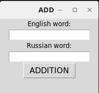
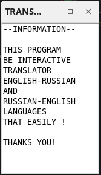

> # interactive_translate_ru_en

> Requirements

```bash
# windows
pip install tk

# linux (ubuntu)
sudo apt-get install python3-tk

```

---

> Install

```bash
git clone https://github.com/YuranIgnatenko/interactive_translate_ru_en.git
```

---

> Main page


> Add word



> Open info



---
